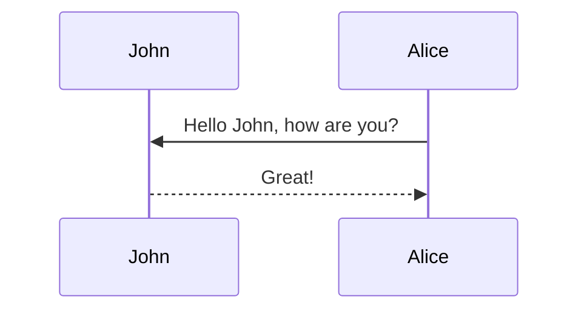

In diesem Thema wird [jekyll-Diagramme](https://github.com/zhustec/jekyll-diagrams){:target="\_blank"} Plugin vorgestellt.
Wir erzeugen einige Beispiele für Diagramme mit Sprachen wie [Mermaid](https://mermaid-js.github.io/mermaid/){:target="\_blank"}, [Plantuml](https://plantuml.com/){:target="\_blank"}, [Vega-Lite](https://vega.github.io/vega-lite/){:target="\_blank"}, und mehr.

**Hinweis:** Verschiedene Pakete zur Diagrammerstellung benötigen externe Abhängigkeiten auf Ihrem Rechner.
Beachten Sie, dass die erste Erstellung Ihrer Jekyll-Website nach dem Hinzufügen neuer Diagramme *LANGSAM* sein kann.
Also, be mindful of that because of diagram generation the fist time you build your Jekyll website after adding new diagrams will be SLOW.
Für mehr Informationen, siehe[jekyll-diagrams](https://github.com/zhustec/jekyll-diagrams){:target="\_blank"} README.


## Mermaid

nstallieren Sie Mermaid mit dem `node.js` Paketmanager `npm` durch den folgenden Befehl:
```bash
npm install -g mermaid.cli
```

Das folgende Diagramm wurde mit diesem Code erzeugt:

````markdown

````


