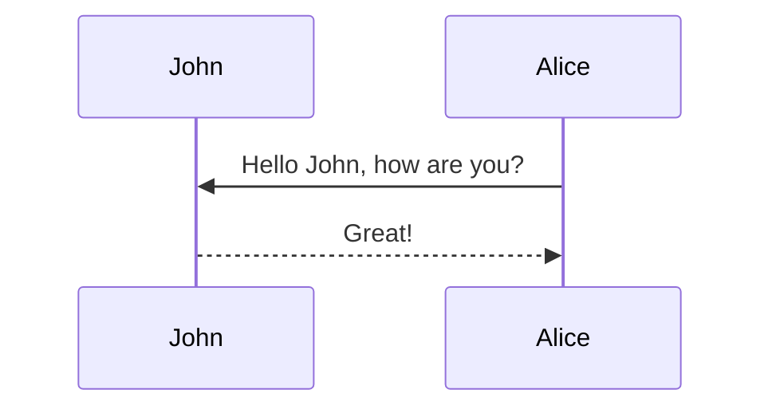

This theme supports generating various diagrams from a text description using [jekyll-diagrams](https://github.com/zhustec/jekyll-diagrams){:target="\_blank"} plugin.
Below, we generate a few examples of such diagrams using languages such as [mermaid](https://mermaid-js.github.io/mermaid/){:target="\_blank"}, [plantuml](https://plantuml.com/){:target="\_blank"}, [vega-lite](https://vega.github.io/vega-lite/){:target="\_blank"}, etc.

**Note:** different diagram-generation packages require external dependencies to be installed on your machine.
Also, be mindful of that because of diagram generation the fist time you build your Jekyll website after adding new diagrams will be SLOW.
For any other details, please refer to [jekyll-diagrams](https://github.com/zhustec/jekyll-diagrams){:target="\_blank"} README.


## Mermaid

Install mermaid using `node.js` package manager `npm` by running the following command:
```bash
npm install -g mermaid.cli
```

The diagram below was generated by the following code:

````markdown

````

